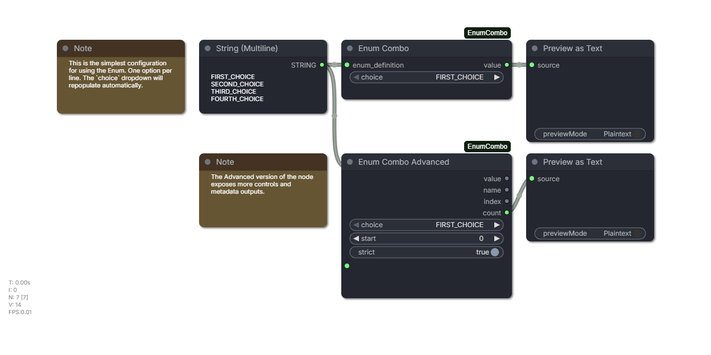

# ComfyUI-EnumCombo

Workflow-local enumerated values for ComfyUI.



## Purpose

ComfyUI-EnumCombo adds small enum selector nodes for workflows that use named modes but need integer values at runtime.

This is useful for dynamic workflows built around lazy index switches, Set/Get variables, or shared control values. For example, you can define:

```text
TXT2IMG
IMG2IMG
INPAINT
```

Then select `IMG2IMG` from a dropdown and pass its integer value to a Set node, a lazy switch index, or any other node that expects an `INT`.

The goal for me was to replace note-based integer conventions like `0 = TXT2IMG` with a readable dropdown while keeping the runtime graph simple and strongly typed.

## Versus Other Alternatives

ComfyUI has a Beta node called [CustomCombo](https://docs.comfy.org/built-in-nodes/CustomCombo) that allows for the creation of a custom dropdown list. EnumCombo has some advantages over it:

- CustomCombo takes up a lot of space vertically, as each option you add increases the height of the node. With EnumCombo, you can link to your options from a separate node that can be independently collapsed.
- You cannot rearrange the order of CustomCombo options.
- At the time of writing, CustomCombo has a bug where it fails to delete an option after clearing its value. e.g. `value_one / [blank] / value_three` will incorrectly allow the blank option to persist.
- CustomCombo seems to break when adding entries with special characters.
- CustomCombo lacks the flexibility of an enum definition, e.g. you cannot re-index entries nor add comments.

---

There's another alternative called [CRZnodes](https://github.com/CoreyCorza/ComfyUI-CRZnodes) has a flexible custom dropdown and mapper system, and it can solve a similar problem. ComfyUI-EnumCombo is intentionally narrower:

- No third-party Python dependencies.
- No wildcard output type for the basic enum value.
- No dynamic input sockets or broad graph monkey-patching.
- Strict `INT` and `STRING` outputs where appropriate.
- A compact node for common workflows and an advanced node when extra metadata is useful.

Use CRZnodes if you want its broader dashboard-style node set or arbitrary data mapping. Use ComfyUI-EnumCombo when you only need lightweight enum-to-integer workflow controls.


## Syntax

Each non-empty line defines one enum member:

```text
OPTION_A
OPTION_B
```

Values are zero-based by default. Explicit integer assignments reset the next automatic value:

```text
TXT2IMG = 3
IMG2IMG
INPAINT
```

This produces `TXT2IMG = 3`, `IMG2IMG = 4`, and `INPAINT = 5`.

Quote labels that need spaces:

```text
"Text to Image" = 0
"Image to Image"
"Inpaint Masked Area"
```

Supported comments:

```text
# line comment
// line comment
/*
block comment
*/
```

## Outputs

`Enum Combo` outputs:

- `value`: selected enum integer value.

`Enum Combo Advanced` outputs:

- `value`: selected enum integer value.
- `name`: selected enum name.
- `index`: selected zero-based list position.
- `count`: number of enum members.

## Nodes

- `Enum Combo`: compact node with a socket-only `enum_definition` input and one `INT` output. Its choice dropdown refreshes when the definition link changes, when the linked source widget changes, and before the choice widget opens.
- `Enum Combo Advanced`: editable multiline `enum_definition`, `start`, `strict`, and extra metadata outputs.
